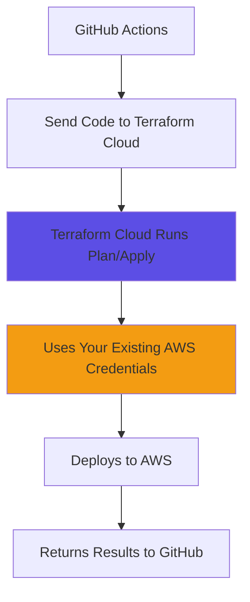

# Using HCP Terraform Credentials - No GitHub Secrets Needed!

## 🎯 **Problem Solved**

You asked: *"I don't have my AWS credentials available. I have them only in my HCP Terraform Project. How do I get my secrets for AWS into my GitHub repository?"*

**Answer**: You **DON'T need to**! We can use your existing HCP Terraform credentials with **remote operations**.

## ✅ **Solution: Terraform Cloud Remote Operations**

Instead of running Terraform locally in GitHub Actions (which would need AWS credentials), we'll run operations **remotely in Terraform Cloud** where your credentials already exist.

### **How It Works**



### **What You Already Have Set Up**

✅ **HCP Terraform Workspace** with:
- `AWS_ACCESS_KEY_ID` (Environment Variable)
- `AWS_SECRET_ACCESS_KEY` (Environment Variable, Sensitive)
- `AWS_SESSION_TOKEN` (if using temporary credentials)

✅ **Remote Backend Configuration**:
```hcl
# In terraform/versions.tf
backend "remote" {
  organization = "tim-krebs-org"
  workspaces {
    name = "vault-lab"
  }
}
```

## 🔧 **Required GitHub Secret (Only One!)**

You only need **ONE secret** in GitHub:

### **TF_API_TOKEN**
1. Go to [Terraform Cloud](https://app.terraform.io) → User Settings → Tokens
2. Create a new API token
3. Add it to GitHub: Repository Settings → Secrets → Actions → New secret
   - Name: `TF_API_TOKEN`
   - Value: `your-terraform-cloud-api-token`

## 📝 **Updated Workflow Configuration**

The workflow has been updated to use remote operations:

```yaml
# .github/workflows/terraform.yml
- name: Setup Terraform
  uses: hashicorp/setup-terraform@v1
  with:
    cli_config_credentials_token: ${{ secrets.TF_API_TOKEN }}
    terraform_wrapper: false  # Better output handling

- name: Terraform Plan
  run: terraform plan -input=false
  env:
    TF_IN_AUTOMATION: true  # Tells TFC this is automated

- name: Terraform Apply
  if: github.ref == 'refs/heads/main' && github.event_name == 'push'
  run: terraform apply -auto-approve -input=false
  env:
    TF_IN_AUTOMATION: true
```

## 🚀 **Benefits of This Approach**

| ✅ **Advantages** | ❌ **Duplicating Credentials** |
|-------------------|--------------------------------|
| **Single Source of Truth**: Credentials only in TFC | Credentials in multiple places |
| **Security**: No credential duplication | Risk of credential drift |
| **Compliance**: Centralized credential management | Multiple credential stores to audit |
| **Simplicity**: One token vs multiple secrets | Complex secret management |
| **Rotation**: Update once in TFC | Update in TFC AND GitHub |

## 📋 **Step-by-Step Setup**

### **1. Verify Your TFC Workspace**

Make sure your HCP Terraform workspace has:

```bash
# Environment Variables in TFC workspace:
AWS_ACCESS_KEY_ID = your-access-key
AWS_SECRET_ACCESS_KEY = your-secret-key (marked as sensitive)
AWS_SESSION_TOKEN = your-session-token (if temporary creds, marked as sensitive)
```

### **2. Add GitHub Secret**

```bash
# Only ONE secret needed in GitHub:
TF_API_TOKEN = your-terraform-cloud-api-token
```

### **3. Update Organization Name**

```hcl
# In terraform/versions.tf
backend "remote" {
  organization = "your-org-name"  # Replace with YOUR organization
  workspaces {
    name = "vault-lab"
  }
}
```

### **4. Push and Deploy**

```bash
git add .
git commit -m "Update for remote operations"
git push origin main
```

## 🔍 **How to Verify It's Working**

1. **Check GitHub Actions**:
   - Go to Actions tab in your repository
   - You should see the workflow running
   - No AWS credential errors

2. **Check Terraform Cloud**:
   - Go to your workspace in [app.terraform.io](https://app.terraform.io)
   - You should see runs triggered by GitHub
   - Plans and applies happen in TFC, not GitHub

3. **Workflow Output**:
   ```
   ✅ Terraform Init: Successful
   ✅ Terraform Plan: Running in Terraform Cloud
   ✅ Plan completed in workspace: vault-lab
   ✅ Terraform Apply: Running remotely
   ```

## 🛠️ **Troubleshooting**

### **Common Issues & Solutions**

#### **1. "No valid credential sources found"**
```bash
# This means TFC doesn't have AWS credentials
# Solution: Add AWS credentials to your TFC workspace environment variables
```

#### **2. "Organization not found"**
```bash
# Solution: Update organization name in terraform/versions.tf
backend "remote" {
  organization = "YOUR-ACTUAL-ORG-NAME"
}
```

#### **3. "Workspace not found"**
```bash
# Solution: Create workspace in TFC or update name in versions.tf
workspaces {
  name = "YOUR-ACTUAL-WORKSPACE-NAME"
}
```

#### **4. "Invalid API token"**
```bash
# Solution: Generate new TF_API_TOKEN and update GitHub secret
```

## 🔒 **Security Best Practices**

1. **Use Team Tokens**: For production, use team tokens instead of user tokens
2. **Least Privilege**: Give GitHub token only the permissions needed
3. **Workspace Isolation**: Use separate workspaces for different environments
4. **Credential Rotation**: Regularly rotate AWS and TFC credentials

## 💡 **Pro Tips**

### **Workspace-Specific Configuration**

If you have multiple environments:

```hcl
# For dev environment
workspaces {
  name = "vault-lab-dev"
}

# For prod environment  
workspaces {
  name = "vault-lab-prod"
}
```

### **Auto-Apply Configuration**

In Terraform Cloud workspace settings:
- ✅ **Auto-apply**: Enable for automatic applies on main branch
- ⚠️ **Plan-only**: Use for pull requests (manual approval required)

## 🎯 **Summary**

**What you DON'T need**:
- ❌ AWS credentials in GitHub secrets
- ❌ Duplicate credential management
- ❌ Complex setup

**What you DO need**:
- ✅ One `TF_API_TOKEN` in GitHub
- ✅ AWS credentials in your TFC workspace (you already have this!)
- ✅ Correct organization/workspace names in `versions.tf`

**Result**: Terraform operations run remotely in Terraform Cloud using your existing AWS credentials, with results displayed in GitHub Actions. Simple, secure, and no credential duplication! 